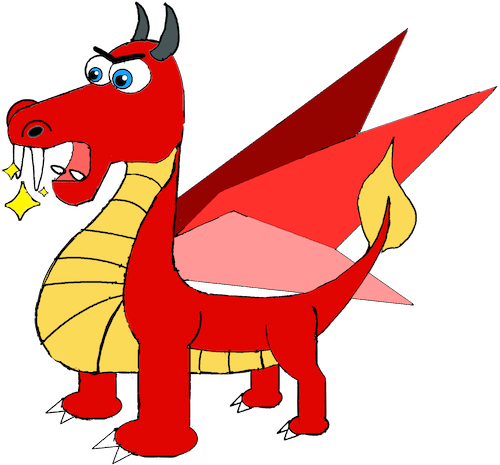
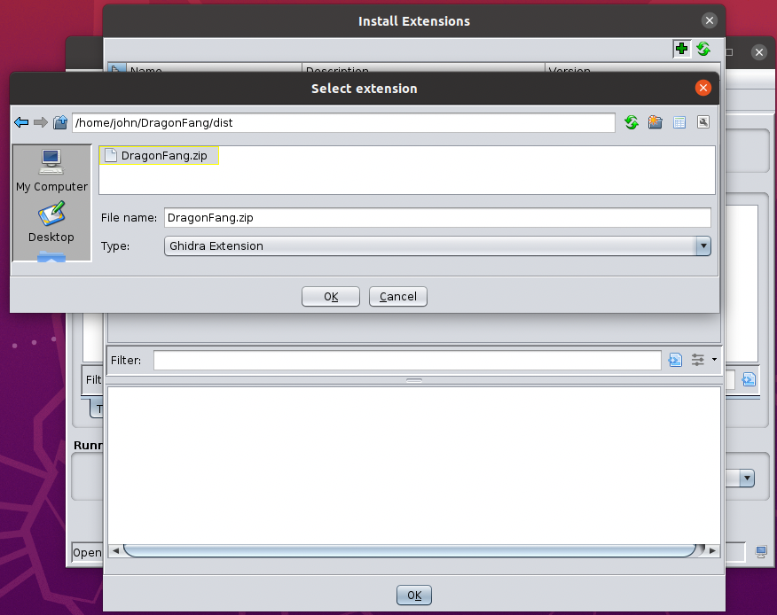

# Dragon Fang

<p align="center">

A program diffing extension for Ghidra. 

Dragon Fang attempts to map corresponding functions present in two versions of the same binary application. At a high-level, the approach taken by Dragon Fang is similar to BinDiff. Features are extracted from all candidate functions and are matched according to uniqueness. These features describe characteristics of functions (e.g., number of basic blocks and edges) and are represented as numeric values stored inside vectors. A propagation step then follows after the initial matching to derive additional results, leveraging structural information of the programs. In particular, based on properties of call-graphs, sets of unmatched functions, relative to already matched functions, are obtained. Crucially, it is these smaller and limited sets which are then considered during the matching process as the chance of finding a unique feature vector increases as a result.

Dragon Fang is implemented as a correlator that can be invoked via Ghidra's Version Tracker tool. 

## Build

In order to build Dragon Fang, simply use gradle, passing the path to Ghidra's home directory as an argument.
 
```
cd dragon-fang
/gradle-7.3/bin/gradle -PGHIDRA_INSTALL_DIR=$GHIDRA_HOME
```

Finally, install the extension through Ghidra (via File --> Install Extensions..)

<p align="center">

